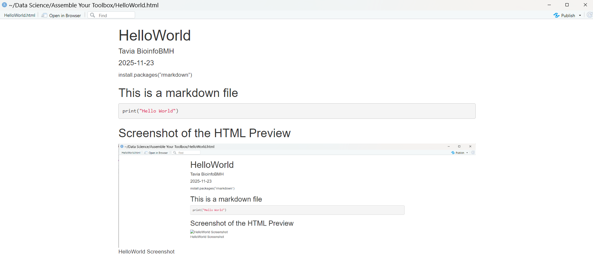

install.packages("rmarkdown")

---
title: "HelloWorld"
author: "Tavia BioinfoBMH"
date: "2025-11-23"
output:  html_document
---

## This is a markdown file

```r
print("Hello World")
```

## Screenshot of the HTML Preview



